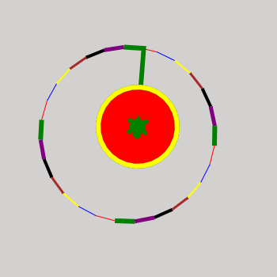

Fork of Turtle package `mobilechelonian <https://github.com/takluyver/mobilechelonian>`.

*"Nevertheless... the turtle moves!"* - Small Gods, by Terry Pratchett

This is a Turtle module for the Jupyter Notebook. It's based on code by
`aspidites <https://github.com/macewanCMPT395/aspidites>`_, one of two groups at
`Macewan University <http://macewan.ca/wcm/index.htm>`_ that built Turtle
as a class assignment (the other was `PACattack <http://macewancmpt395.github.io/PACattack/>`_;
I could have based this on either, but I had to pick one).

Install it in a terminal/command prompt with::

    pip install git+https://github.com/mathieuLacroix/turtleIutv.git

Using it looks like this::

    from turtleIutv import *
    drawing()
    speed(5)
    colours=["red","blue","yellow","brown","black","purple","green"]
    up() 
    left(90)
    forward(200)
    right(90)
    down()
    i = 0
    while i < 18:
        setColor(colours[i%7])
        right(20)
        forward(50)
        i += 1
    goto(200, 200)

.. image:: http://mybinder.org/badge.svg
   :target: https://beta.mybinder.org/v2/gh/lacroix/turtleIutv/master?filepath=try.ipynb
